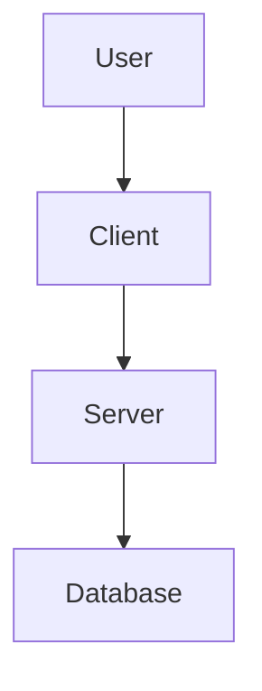
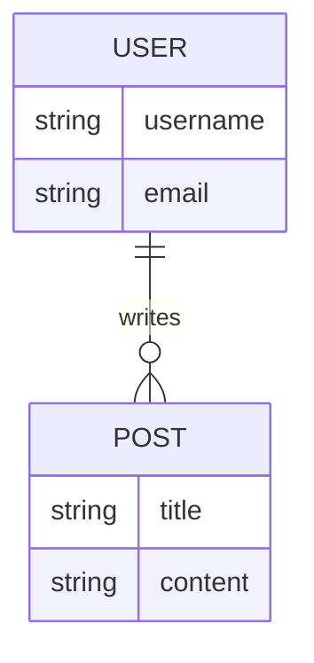
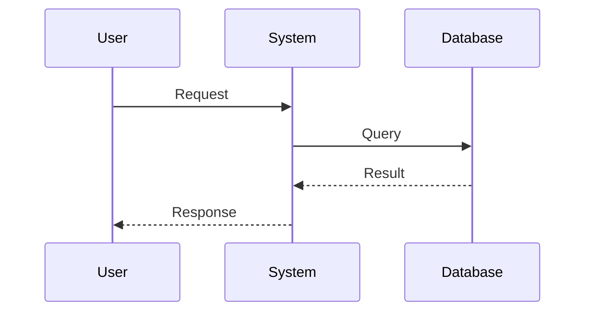

# Architecture Design Document

## 1. Executive Summary
*Briefly describe the high-level architectural approach and key decisions.*

## 2. System Overview
### 2.1 Component Diagram
*Use MermaidJS to show high-level components and their interactions.*

### 2.2 Tech Stack
- **Language**:
- **Frameworks**:
- **Storage**:
- **Infrastructure**:

## 3. Data Design
### 3.1 Data Models
*Describe core entities and their relationships.*

### 3.2 Schema Design

## 4. API Design
*Define key interfaces (REST, GraphQL, gRPC, or internal Python classes).*

## 5. Key Flows
*Sequence diagrams for critical user stories.*

## 6. Security & Performance
*List specific constraints and strategies.*
- Authentication/Authorization
- Caching strategy
- Rate limiting

## 7. Open Questions
- [ ] Question 1?
